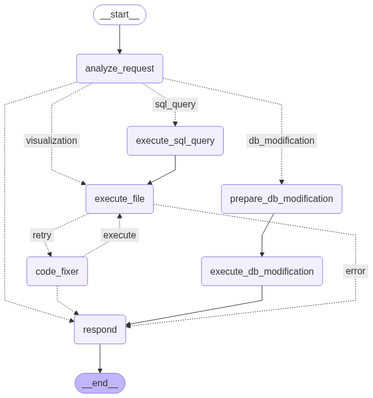

# EY Project – AI-Powered Operations Research Platform

## Overview
EY Project is an end-to-end, AI-powered environment for data-driven decision making and optimisation.  A conversational interface lets analysts query a SQL database, create on-demand visualisations, change model parameters and execute Python optimisation models – all from natural language.

The application is split into a Python/FastAPI backend and an Angular frontend.  A LangGraph-based agent orchestrates every request, dynamically routing it through specialised nodes that generate SQL, build visualisations, modify the database or fix code when errors occur.

---

## Key Capabilities
• Natural-language SQL queries with automatic schema discovery.
• One-click visualisation – the agent writes and runs Python/Plotly code and returns interactive charts.
• Parameter management – update any value stored in the SQLite database and immediately rerun optimisation models.
• File execution – run arbitrary Python scripts located in the project.
• Resilient code execution – a self-healing "code_fixer" node automatically patches and re-executes faulty scripts.
• Persistent chat history – browser-side storage keeps recent messages (LangGraph memory is temporarily disabled).

---

## High-Level Agent Workflow

```mermaid
-graph TD;
-    Start((START)) --> Analyze["analyze_request"]
-    Analyze -->|"sql_query"| ExecuteSQL["execute_sql_query"]
-    ExecuteSQL --> ExecuteFile["execute_file"]
-    Analyze -->|"visualization"| ExecuteFile
-    Analyze -->|"db_modification"| PrepareDB["prepare_db_modification"]
-    PrepareDB --> ExecuteDB["execute_db_modification"]
-    ExecuteFile -->|"success"| Respond
-    ExecuteFile -->|"retry"| CodeFixer["code_fixer"] --> ExecuteFile
-    ExecuteFile -->|"error"| Respond
-    ExecuteDB --> Respond
-    Respond --> End((END))
-```
+
+

Each coloured edge represents a conditional route chosen at run-time.  For example, after a file is executed the workflow branches depending on whether it **succeeded**, requires a **retry** via the *code_fixer*, or produced a non-recoverable **error**.

---

## Repository Layout
```text
EYProjectGit/
├── backend/     # Python ✕ FastAPI server + LangGraph agent
├── frontend/    # Angular SPA
├── docs/        # Technical guides (see below)
└── outputs/     # Generated files, charts and logs
```

---

## Quick-Start
1. Clone the repo
   ```bash
   git clone <repository-url>
   cd EYProjectGit
   ```
2. Install dependencies
   ```bash
   # Frontend
   cd frontend && npm install && cd ..

   # Backend
   cd backend && pip install -r requirements.txt && cd ..
   ```
3. Copy the environment template and add your keys
   ```bash
   cp EY.env.example EY.env
   # edit EY.env
   ```
4. Launch
   ```bash
   # Backend
   cd backend && python main.py &
   # Frontend (second terminal)
   cd frontend && ng serve
   ```
5. Visit http://localhost:4200

---

## Documentation Map
The **docs/** folder contains self-contained guides for every subsystem:

• SETUP_GUIDE – local installation & environment variables  
• FRONTEND_STARTUP_GUIDE – developing the Angular client  
• SQL_INTEGRATION_GUIDE – how the agent builds, validates and runs SQL  
• PARAMETER_SYNCHRONIZATION_GUIDE – keeping Excel-originated parameters in sync with the database  
• NEW_AGENT_WORKFLOW_IMPLEMENTATION – detailed explanation of the LangGraph workflow  

All guides focus on *how the feature works* rather than its development history or bug-fix logs.

---

