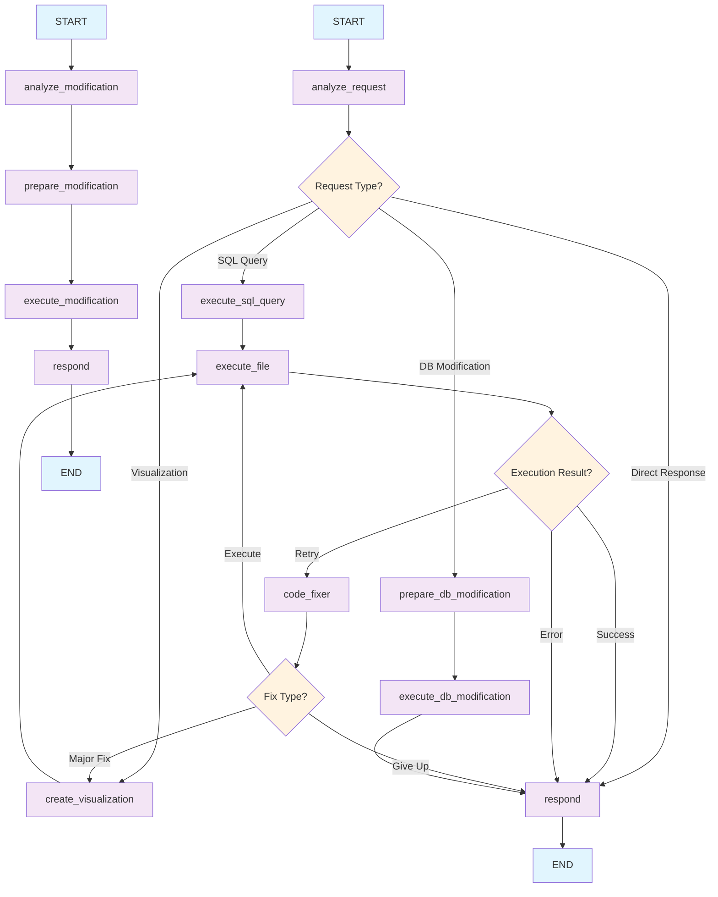

# 🤖 EY Project - AI-Powered Operations Research Platform

<!-- WORKFLOW_DIAGRAM_START -->



<!-- WORKFLOW_DIAGRAM_END -->


## 🎯 Overview

The EY Project is a comprehensive AI-powered platform for operations research, featuring advanced database management, visualization capabilities, and intelligent data analysis. Built with Angular frontend and Python backend, it provides an intuitive interface for data analysis, visualization, and database parameter management.

## 🚀 Key Features

- **Multi-Agent AI System**: Specialized agents for different operations
- **Database Integration**: Direct SQL execution and parameter management
- **Visualization Engine**: Dynamic chart and graph generation
- **Query-Specific File Tracking**: Only shows files generated during current query
- **Memory Management**: LangGraph-based conversation persistence
- **Error Recovery**: Automatic code fixing and retry mechanisms
- **Intelligent Routing**: Automatically determines operation type from user requests

## 🏗️ Architecture

### Frontend (Angular)
- **Modern UI**: Responsive design with real-time updates
- **File Management**: Upload, edit, and organize project files
- **Chat Interface**: Natural language interaction with AI agents
- **Database Browser**: Intuitive database exploration and management
- **Output Display**: Query-specific file generation tracking

### Backend (Python/FastAPI)
- **LangGraph Agents**: Multi-agent workflow orchestration
- **Database Engine**: SQLite with advanced query capabilities
- **File Processing**: Dynamic Python script execution
- **Memory System**: Persistent conversation state management
- **API Integration**: RESTful endpoints for all operations

## 🧠 AI Agents

### Data Analyst Agent (Primary)
- **Role**: Main intelligence for routing and coordination
- **Capabilities**: 
  - SQL queries with Python script execution
  - Visualization generation (matplotlib, plotly, seaborn)
  - Database parameter modifications
  - Error recovery and code fixing
- **Memory**: LangGraph-based conversation persistence

### Database Modifier Agent (Specialist)
- **Role**: Specialized database parameter management
- **Capabilities**: 
  - Direct database modifications without approval
  - SQL UPDATE statement execution
  - Transaction-safe database operations
  - Immediate response after modifications

## 🔄 Workflow

```
User Request → Agent Classification → Specialized Processing → Results
     ↓              ↓                      ↓                    ↓
Natural Language → SQL/Visualization → Database/Model → Formatted Output
```

### Execution Paths
1. **SQL Queries**: Python script creation and execution with formatted results
2. **Visualizations**: Python script creation and execution with error handling
3. **Database Changes**: Direct modification without automatic model execution
4. **Error Recovery**: Automatic code fixing for failed executions

## 📁 Project Structure

```
EYProjectGit/
├── frontend/                 # Angular application
│   ├── src/app/
│   │   ├── components/       # UI components
│   │   │   ├── chat/         # Chat interface
│   │   │   ├── file-tree/    # File management
│   │   │   ├── output-display/ # Execution results
│   │   │   └── sql-query/    # Database browser
│   │   ├── services/         # API services
│   │   └── pipes/           # Data transformation
│   └── package.json
├── backend/                  # Python FastAPI server
│   ├── main.py              # Main application
│   ├── langgraph_agent.py   # AI agent implementation
│   └── requirements.txt
├── docs/                    # Documentation
├── outputs/                 # Generated files
└── README.md
```

## 🛠️ Installation

### Prerequisites
- Node.js (v16+)
- Python (v3.8+)
- Git

### Quick Start
1. **Clone the repository**
   ```bash
   git clone <repository-url>
   cd EYProjectGit
   ```

2. **Install dependencies**
   ```bash
   # Install frontend dependencies
   cd frontend
   npm install
   
   # Install backend dependencies
   cd ../backend
   pip install -r requirements.txt
   ```

3. **Configure environment**
   ```bash
   # Copy environment template
   cp EY.env.example EY.env
   
   # Edit EY.env with your API keys
   nano EY.env
   ```

4. **Launch the application**
   ```bash
   # Start backend server
   cd backend
   python main.py
   
   # Start frontend (in new terminal)
   cd frontend
   ng serve
   ```

5. **Access the application**
   - Frontend: http://localhost:4200
   - Backend API: http://localhost:8001

## 🎯 Usage Examples

### Database Queries
```
User: "Show me the top 10 records from the inventory table"
System: [Creates Python script → Executes SQL → Returns formatted results]
```

### Visualizations
```
User: "Create a bar chart showing sales by region"
System: [Generates Python visualization script → Executes → Displays chart]
```

### Database Modifications
```
User: "Change the maximum capacity to 5000"
System: [Identifies parameter → Executes UPDATE → Confirms modification]
```

### Error Recovery
```
User: "Create a complex visualization"
System: [Generates script → Execution fails → Auto-fixes code → Retries → Success]
```

## 🔧 Configuration

### Environment Variables
```bash
# API Configuration
OPENAI_API_KEY=your_openai_key
GOOGLE_API_KEY=your_google_key

# Database Configuration
DATABASE_PATH=./data/project.db

# Server Configuration
HOST=0.0.0.0
PORT=8000
```

### Agent Configuration
```python
# Agent types available
AGENT_TYPES = ["data_analyst", "database_modifier"]

# Memory configuration
MEMORY_TYPE = "sqlite"  # or "memory"
```

## 📚 Documentation

- **[Setup Guide](docs/SETUP_GUIDE.md)** - Complete installation instructions
- **[Frontend Guide](docs/FRONTEND_STARTUP_GUIDE.md)** - Angular development guide
- **[SQL Integration](docs/SQL_INTEGRATION_GUIDE.md)** - Database query capabilities
- **[Database Browser](docs/DATABASE_BROWSER_IMPLEMENTATION.md)** - Database management features
- **[LangGraph Memory](docs/LANGGRAPH_MEMORY_IMPLEMENTATION.md)** - Conversation persistence
- **[Chat Persistence](docs/CHAT_PERSISTENCE_IMPLEMENTATION.md)** - Chat state management
- **[File Management](docs/TEMP_FILE_MANAGEMENT.md)** - Temporary file handling
- **[Query-Specific File Tracking](docs/QUERY_SPECIFIC_FILE_TRACKING.md)** - File generation tracking
- **[Execution Output Fixes](docs/EXECUTION_OUTPUT_FIXES.md)** - Output display improvements

## 🧪 Testing

### Backend Testing
```bash
cd backend
python -m pytest tests/
```

### Frontend Testing
```bash
cd frontend
ng test
```

### Integration Testing
```bash
# Run full system tests
python tests/integration_test.py
```

## 🔍 Key Components

### LangGraph Workflow
The system uses LangGraph for workflow orchestration with two main agents:

1. **Data Analyst Agent**: Handles SQL queries, visualizations, and database modifications
2. **Database Modifier Agent**: Specialized for direct database parameter changes

### File Generation Tracking
- Only shows files created during the current query
- Prevents confusion from files generated in previous queries
- Provides clear context for generated outputs

### Error Recovery System
- Automatic code fixing for failed script executions
- Retry mechanisms with intelligent error analysis
- Fallback strategies for different error types

### Memory Management
- LangGraph-based conversation persistence
- Thread-based memory isolation
- Automatic cleanup of old sessions