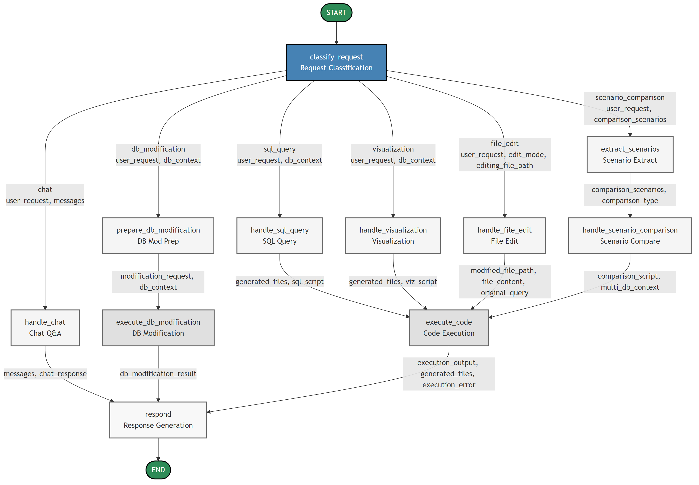

# EY Project – AI-Powered Operations Research Platform

## Overview
EY Project is an end-to-end, AI-powered environment for data-driven decision making and optimisation.  A conversational interface lets analysts query a SQL database, create on-demand visualisations, change model parameters and execute Python optimisation models – all from natural language.

The application is split into a Python/FastAPI backend and an Angular frontend.  A LangGraph-based agent orchestrates every request, dynamically routing it through specialised nodes that generate SQL, build visualisations, modify the database or fix code when errors occur.

---

## Key Capabilities
• Natural-language SQL queries with automatic schema discovery.
• One-click visualisation – the agent writes and runs Python/Plotly code and returns interactive charts.
• Parameter management – update any value stored in the SQLite database and immediately rerun optimisation models.
• File execution – run arbitrary Python scripts located in the project.
• Resilient code execution – a self-healing "code_fixer" node automatically patches and re-executes faulty scripts.
• Persistent chat history – browser-side storage keeps recent messages (LangGraph memory is temporarily disabled).

---

## High-Level Agent Workflow

The system uses two specialized agents working together:

1. **Data Analyst Agent** (Blue): Handles the main workflow including:
   - Request analysis and classification
   - SQL query generation and execution
   - Database modifications
   - File execution for visualizations
   - Response generation

2. **Code Fixer Agent** (Red): Provides error recovery by:
   - Analyzing execution errors
   - Fixing code issues automatically
   - Handling both simple fixes (syntax, imports) and major restructuring
   - Re-executing corrected code



Each edge represents a conditional route chosen at run-time. The workflow intelligently routes requests through:
- SQL queries for data retrieval
- Visualization generation via Python scripts
- Database modifications for parameter updates
- Code fixing when execution errors occur

All paths eventually converge to generate a response, ensuring a complete interaction cycle.

---

## Repository Layout
```text
EYProjectGit/
├── backend/     # Python ✕ FastAPI server + LangGraph agent
├── frontend/    # Angular SPA
├── docs/        # Technical guides (see below)
└── outputs/     # Generated files, charts and logs
```

---

## Quick-Start
1. Clone the repo
   ```bash
   git clone <repository-url>
   cd EYProjectGit
   ```
2. Install dependencies
   ```bash
   # Frontend
   cd frontend && npm install && cd ..

   # Backend
   cd backend && pip install -r requirements.txt && cd ..
   ```
3. Copy the environment template and add your keys
   ```bash
   cp EY.env.example EY.env
   # edit EY.env
   ```
4. Launch
   ```bash
   # Backend
   cd backend && python main.py &
   # Frontend (second terminal)
   cd frontend && ng serve
   ```
5. Visit http://localhost:4200

---

## Documentation Map
The **docs/** folder contains self-contained guides for every subsystem:

• [SETUP_GUIDE](docs/SETUP_GUIDE.md) – local installation & environment variables  
• [FRONTEND_STARTUP_GUIDE](docs/FRONTEND_STARTUP_GUIDE.md) – developing the Angular client  
• [SQL_INTEGRATION_GUIDE](docs/SQL_INTEGRATION_GUIDE.md) – how the agent builds, validates and runs SQL  
• [PARAMETER_SYNCHRONIZATION_GUIDE](docs/PARAMETER_SYNCHRONIZATION_GUIDE.md) – keeping Excel-originated parameters in sync with the database  
• [NEW_AGENT_WORKFLOW_IMPLEMENTATION](docs/NEW_AGENT_WORKFLOW_IMPLEMENTATION.md) – detailed explanation of the LangGraph workflow  
• [DATABASE_BROWSER_IMPLEMENTATION](docs/DATABASE_BROWSER_IMPLEMENTATION.md) – database browser implementation details  
• [HUMAN_IN_LOOP_IMPLEMENTATION_SUMMARY](docs/HUMAN_IN_LOOP_IMPLEMENTATION_SUMMARY.md) – human-in-the-loop features  
• [TEMP_FILE_MANAGEMENT](docs/TEMP_FILE_MANAGEMENT.md) – temporary file handling and cleanup

All guides focus on *how the feature works* rather than its development history or bug-fix logs.

---

