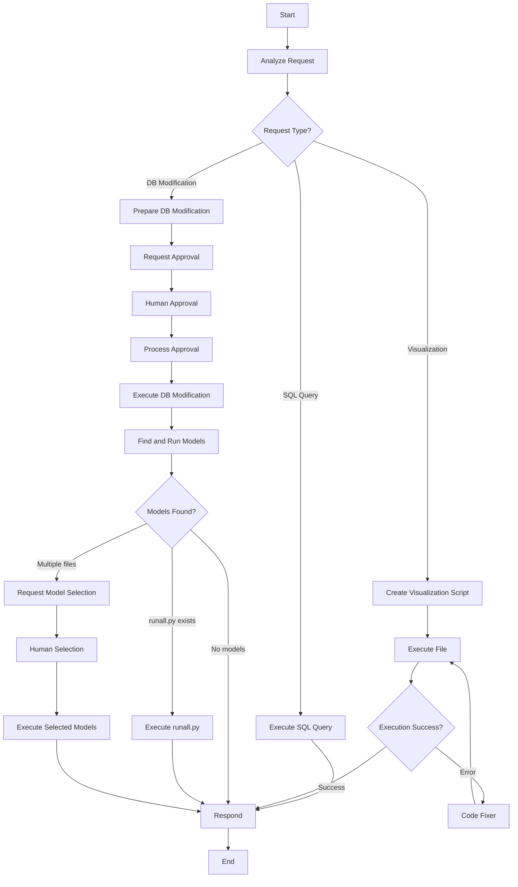

# New Agent Workflow Implementation

## Overview

This document describes the completely redesigned agent workflow that replaces the previous SQL Query Agent system with a more intelligent and flexible architecture centered around the **Data Analyst Agent**.

## Key Changes

### ❌ **Removed Components**
- **SQL Query Agent**: The specialized 4-step SQL pipeline has been removed
- **Action-based routing**: Previous action classification system replaced

### ✅ **New Architecture**

#### 1. **Data Analyst Agent** (Main Intelligence)
- **Role**: Primary decision-maker for all database-related requests
- **Capabilities**:
  - Receives complete database schema
  - Analyzes user requests to determine optimal response strategy
  - Executes SQL queries directly for simple data requests
  - Creates Python visualization scripts for complex visual requests
  - Identifies and prepares database modification requests

#### 2. **Database Modifier Agent** (Specialist)
- **Role**: Handles database modifications with human-in-the-loop approval
- **Capabilities**:
  - Receives modification requests from Data Analyst
  - Prepares exact SQL UPDATE statements
  - Requests human approval before making changes
  - Executes approved modifications
  - Automatically finds and runs model files after changes

## New Workflow Architecture

### 🔄 **Data Analyst Workflow**



## Request Type Classification

### 🔍 **Intelligent Request Analysis**
The Data Analyst Agent analyzes each request using the database schema and classifies it into one of three types:

#### 1. **SQL_QUERY**
- **Description**: Straightforward data requests requiring simple SQL execution
- **Examples**:
  - "Show me the top 10 hubs with highest demand"
  - "What is the total demand by region?"
  - "List all operating hubs"
- **Response**: Direct SQL execution with formatted results

#### 2. **VISUALIZATION**
- **Description**: Requests requiring charts, graphs, or visual representations
- **Examples**:
  - "Create a chart showing demand distribution"
  - "Visualize hub performance over time"
  - "Show a map of hub locations"
- **Response**: Python script generation with matplotlib/seaborn/plotly

#### 3. **DATABASE_MODIFICATION**
- **Description**: Requests to change parameters or data in the database
- **Examples**:
  - "Change maximum hub demand to 20000"
  - "Update opening cost to 5000"
  - "Set route supply limit to 15000"
- **Response**: Table/column identification and delegation to Database Modifier

## Database Modification Workflow

### 🛠️ **Preparation Phase**
1. **Request Analysis**: Data Analyst identifies what needs to be changed
2. **Table/Column Identification**: Determines exact database locations
3. **Current Value Retrieval**: Fetches existing values for comparison
4. **Modification Request**: Structured data passed to Database Modifier

### 🚨 **Human-in-the-Loop Approval**
The Database Modifier requests explicit user approval showing:
- **Table and Column**: Exact database location
- **Current vs New Values**: What will change
- **SQL Preview**: Exact UPDATE statement to be executed
- **Impact Description**: Explanation of the change

**Approval Format:**
```
🚨 **Database Modification Request**

**Change Summary:**
- Table: parameters
- Column: max_hub_demand
- Current Value: 15000
- New Value: 20000

**Description:** Update maximum hub demand parameter

**SQL to be executed:**
```sql
UPDATE parameters SET max_hub_demand = 20000
```

Do you approve this modification? (yes/no)
```

### ⚙️ **Execution Phase**
After approval:
1. **Database Update**: Execute the SQL modification
2. **Model Discovery**: Search for Python model files
3. **Automatic Execution**: 
   - If `runall.py` exists → Execute automatically
   - If multiple `.py` files → Request user selection
   - If no models → Complete workflow

### 📊 **Model Selection Interface**
When multiple model files are found:
```
🔧 **Model Selection Required**

The following Python model files were found:

1. optimization_model.py
2. sensitivity_analysis.py
3. results_generator.py
4. visualization_suite.py

Which models would you like to execute? (provide numbers separated by commas, or 'all' for all models)
```

## Technical Implementation

### 🏗️ **Agent Configuration Changes**

#### New Data Analyst Config:
```python
"data_analyst": AgentConfig(
    name="Advanced Data Analyst",
    system_prompt="""You are an advanced data analyst that serves as the main intelligence for database operations and analysis.
    
    **REQUEST TYPES YOU HANDLE:**
    1. **SIMPLE SQL QUERIES** - Execute SQL directly, return results
    2. **VISUALIZATION REQUESTS** - Create Python scripts with visualizations  
    3. **DATABASE MODIFICATION REQUESTS** - Identify tables and delegate to modifier agent
    """,
    tools_enabled=True,
    memory_enabled=True
)
```

#### New Database Modifier Config:
```python
"database_modifier": AgentConfig(
    name="Database Modification Specialist", 
    system_prompt="""You are a database modification specialist with human-in-the-loop approval capabilities.
    
    **YOUR WORKFLOW:**
    1. **ANALYZE MODIFICATION REQUEST**: Understand exactly what needs to be changed
    2. **REQUEST HUMAN APPROVAL**: Present proposed changes for confirmation
    3. **EXECUTE CHANGES**: If approved, execute database modifications
    4. **MODEL EXECUTION**: Find and run appropriate .py model files
    """,
    tools_enabled=True,
    memory_enabled=True
)
```

### 🔧 **New State Fields**
Extended `AgentState` with fields for the enhanced workflow:
```python
# Enhanced data analyst workflow fields
request_type: str
sql_query_result: str
visualization_request: str
modification_request: Dict[str, any]
identified_tables: List[str]
identified_columns: List[str]
current_values: Dict[str, any]
new_values: Dict[str, any]
modification_sql: str
available_models: List[str]
selected_models: List[str]
model_execution_results: List[str]
```

### 🎯 **Key Node Methods**

#### Core Analysis:
- `_analyze_data_request()`: Request type classification
- `_route_data_request()`: Workflow routing logic

#### Execution Paths:
- `_execute_sql_query_node()`: Direct SQL execution
- `_create_visualization_node()`: Python script generation
- `_prepare_db_modification_node()`: Modification preparation

#### Database Modifications:
- `_request_approval_node()`: Human approval requests
- `_process_approval_node()`: Approval response handling
- `_execute_db_modification_node()`: Database updates

#### Model Management:
- `_find_and_run_models_node()`: Model discovery
- `_request_model_selection_node()`: User selection interface
- `_execute_selected_models_node()`: Model execution

## Benefits

### 🎯 **Intelligent Decision Making**
- Single agent analyzes context and chooses optimal response strategy
- Schema-aware decision making for better accuracy
- Automatic routing based on request complexity

### 🛡️ **Enhanced Safety**
- Human approval required for all database modifications
- Clear preview of exact changes before execution
- Transaction-safe database operations

### 🔄 **Automated Model Execution**
- Automatic discovery of model files after database changes
- Priority system (runall.py → user selection → no models)
- Comprehensive execution results reporting

### 📊 **Improved User Experience**
- Single entry point for all database operations
- Clear feedback about request classification
- Visual progress indicators for multi-step operations

### 🧠 **Memory Integration**
- LangGraph memory preserves conversation context
- Thread-based conversations for multiple simultaneous sessions
- Human-in-the-loop interrupts maintain state across interactions

## Usage Examples

### Example 1: Simple SQL Query
```
User: "Show me the top 5 hubs with highest demand"
Agent: [Analyzes] → SQL_QUERY → [Executes SQL] → [Returns formatted results]
```

### Example 2: Visualization Request
```
User: "Create a bar chart of demand by region"
Agent: [Analyzes] → VISUALIZATION → [Creates Python script] → [Executes] → [Shows chart]
```

### Example 3: Database Modification
```
User: "Change maximum hub demand to 25000"
Agent: [Analyzes] → DATABASE_MODIFICATION → [Identifies table/column] → 
       [Requests approval] → [User approves] → [Updates database] → 
       [Finds runall.py] → [Executes model] → [Shows results]
```

## Code Output Integration

### 📺 **Execution Window Display**
All code execution output is automatically displayed in the execution window:
- SQL query results
- Python script execution output
- Database modification confirmations
- Model execution results
- Error messages and debugging information

This ensures users can monitor all system activities and see exactly what operations are being performed.

## Migration from Previous System

### ✅ **Compatibility**
- Existing database schemas work without changes
- Human-in-the-loop interrupts use the same API endpoints
- Memory and conversation threading preserved
- File upload and management unchanged

### 🔄 **Behavioral Changes**
- No more specialized SQL query agent
- Database modifications now require explicit approval
- Model execution after database changes is automatic
- Request classification is now intelligent rather than pattern-based

This new architecture provides a more intelligent, safe, and user-friendly approach to database operations while maintaining the flexibility and power of the previous system. 